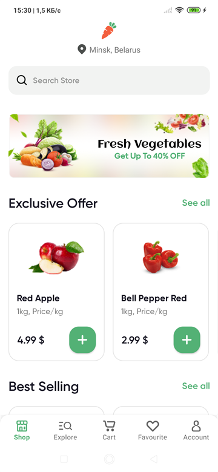
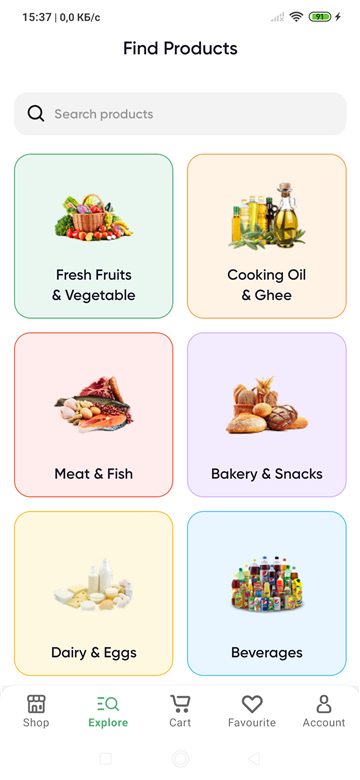
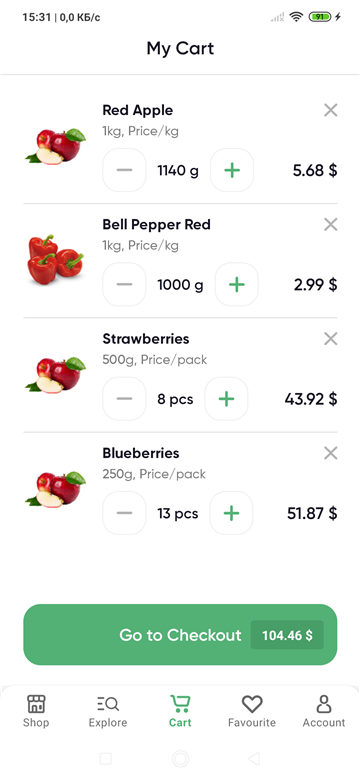
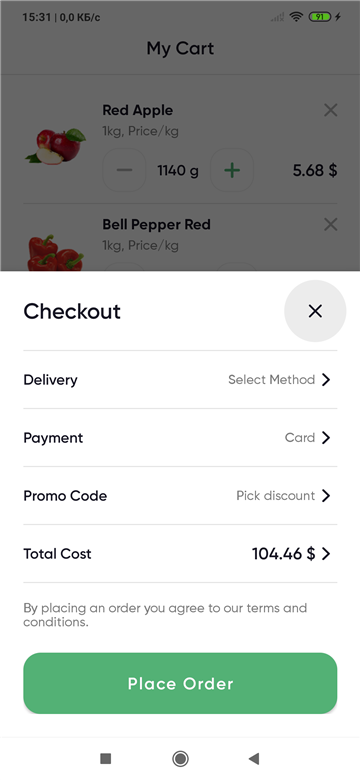
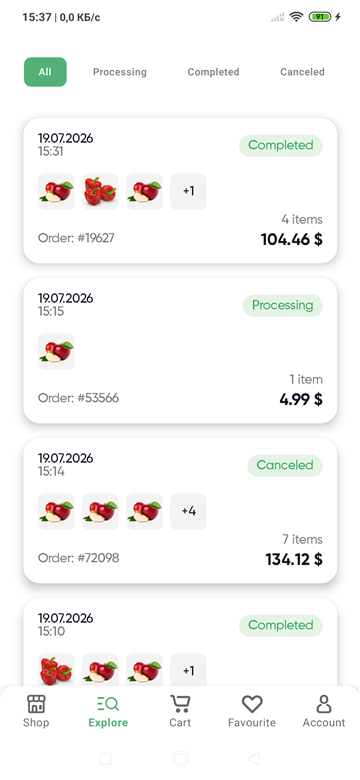
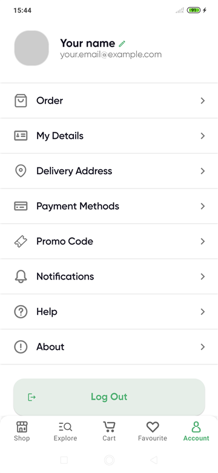

# MyShop

[English version](#english-version)

Android-приложение интернет-магазина продуктов.

Проект делался как учебный, но с попыткой держать структуру ближе к тому, как это обычно выглядит в реальной разработке: отдельные слои, use cases, репозитории, DI, локальная база, сеть, тесты и постепенный переход на Flow/Compose.

Сейчас это не "полноценный магазин с backend-админкой", а законченное V1-приложение для портфолио.

Есть каталог, корзина, избранное, checkout, история заказов и экран аккаунта.

## Что умеет приложение

- показывает каталог товаров;
- загружает товары через Retrofit из удаленного JSON;
- использует локальный fallback-каталог, если загрузка не удалась;
- фильтрует товары по категории, бренду и цене;
- позволяет искать товары;
- открывает детальный экран товара;
- добавляет товары в корзину;
- изменяет количество товаров в корзине;
- считает итоговую стоимость заказа;
- добавляет и удаляет товары из избранного;
- добавляет все избранные товары в корзину;
- открывает checkout через BottomSheet;
- после оформления очищает корзину;
- сохраняет заказ в Room;
- показывает историю заказов;
- хранит имя и email пользователя через DataStore;
- использует Compose для экрана аккаунта и истории заказов.

## Скриншоты

### Shop



### Explore



### Cart



### Checkout



### Orders



### Account



## Demo

Короткое видео с основным flow: каталог, корзина, checkout, оформление заказа и история заказов.

[Смотреть demo](docs/demo/demo.mp4)

## Основной стек

- Kotlin
- Android SDK
- XML layouts + ViewBinding
- Jetpack Compose
- Material 3
- Fragments
- Navigation Component
- Coroutines
- Flow, StateFlow, SharedFlow
- Hilt
- Room
- Retrofit
- Gson converter
- DataStore Preferences
- Lottie
- JUnit
- kotlinx-coroutines-test
- GitHub Actions

## Архитектура

Проект разделен на несколько слоев.

`features` - экраны приложения.

Там лежат Fragment, ViewModel, UI-модели и Compose UI для тех экранов, которые уже переведены на Compose.

`domain` - бизнес-логика.

Тут находятся модели, интерфейсы репозиториев и use cases. Например, расчет корзины, оформление заказа, работа с избранным.

`data` - источники данных.

Тут находятся Room, Retrofit, DataStore, реализации репозиториев и мапперы из data-моделей в domain-модели.

`core` - общие вещи.

Фильтрация, форматирование денег, общие UI-состояния, тема Compose, адаптеры и утилиты, которые используются в разных частях проекта.

## Состояние экранов

Для экранов со списками используется общий подход:

- loading;
- content;
- empty;
- error.

Состояние хранится во ViewModel через StateFlow.

Одноразовые события, например Toast или переход после оформления заказа, передаются через SharedFlow.

## Данные

Товары загружаются через Retrofit из JSON-файла в репозитории.

Если удаленные данные недоступны, приложение использует локальный список товаров. Это сделано специально, чтобы приложение оставалось рабочим даже без сети.

Корзина, избранное и заказы хранятся локально через Room.

Профиль пользователя хранится через DataStore Preferences.

## Checkout и заказы

Checkout реализован как `BottomSheetDialogFragment`.

После нажатия `Place Order` приложение:

1. берет текущую корзину;
2. считает стоимость строк и общий total;
3. создает заказ;
4. сохраняет заказ и товары заказа в Room;
5. очищает корзину;
6. открывает экран успешного оформления;
7. показывает заказ в истории заказов.

История заказов сделана отдельным экраном на Compose с `LazyColumn` и фильтрацией по статусу.

## Тесты

В проекте есть unit-тесты для важной бизнес-логики и ViewModel.

Покрыты, например:

- расчет стоимости корзины;
- изменение количества товаров;
- добавление товаров в корзину;
- добавление избранных товаров в корзину;
- работа избранного;
- оформление заказа;
- реактивное обновление экранов через Flow;
- состояния ViewModel для каталога, корзины, избранного, деталей товара и заказов.

Запуск:

```bash
./gradlew :app:testDebugUnitTest
```

## CI

В проект добавлен GitHub Actions workflow.

На push и pull request запускаются:

- сборка debug APK;
- unit tests;
- lint.

Файл workflow:

```text
.github/workflows/android-ci.yml
```

## Что в проекте сделано осознанно

Проект не пытается быть большим ради размера.

Я сфокусировался на базовых вещах, которые важны для Android-разработки:

- понятное разделение ответственности;
- работа с локальной базой;
- работа с сетью;
- реактивное состояние экранов;
- DI через Hilt;
- тестируемая бизнес-логика;
- постепенное внедрение Compose в существующий Fragment-based проект;
- базовый CI.

## Ограничения V1

- нет авторизации;
- нет настоящего backend для заказов;
- нет админки для изменения товаров;
- оплата и адрес доставки пока являются UI-заглушками;
- история заказов хранится только локально;
- часть интерфейса еще написана на XML, часть - на Compose.

Эти ограничения оставлены намеренно, чтобы не раздувать учебный проект и довести V1 до стабильного состояния.

# English Version

MyShop is an Android grocery shopping app.

It started as a learning project, but I tried to keep the code structure close to real Android development: separate layers, use cases, repositories, dependency injection, local storage, networking, tests, and a gradual migration to Flow and Compose.

This is not a full production store with a real backend admin panel.

It is a finished V1 portfolio project with catalog, cart, favourites, checkout, order history and account screen.

## Features

- product catalog;
- remote catalog loading with Retrofit;
- local fallback catalog when remote loading fails;
- product filtering by category, brand and price;
- product search;
- product details screen;
- cart management;
- quantity update in cart;
- total price calculation;
- favourites;
- add all favourites to cart;
- checkout BottomSheet;
- cart cleanup after placing an order;
- local order saving with Room;
- order history screen;
- user name and email storage with DataStore;
- Compose UI for account and order history screens.

## Screenshots

### Shop


### Explore


### Cart


### Checkout


### Orders


### Account


## Demo

A short video showing the main flow: catalog, cart, checkout, order placement and order history.

[Watch demo](docs/demo/demo.mp4)

## Tech Stack

- Kotlin
- Android SDK
- XML layouts + ViewBinding
- Jetpack Compose
- Material 3
- Fragments
- Navigation Component
- Coroutines
- Flow, StateFlow, SharedFlow
- Hilt
- Room
- Retrofit
- Gson converter
- DataStore Preferences
- Lottie
- JUnit
- kotlinx-coroutines-test
- GitHub Actions

## Architecture

The project is split into several layers.

`features` - app screens.

This layer contains Fragments, ViewModels, UI models and Compose UI for screens that already use Compose.

`domain` - business logic.

This layer contains domain models, repository interfaces and use cases. For example, cart total calculation, placing an order and favourites logic.

`data` - data sources.

This layer contains Room, Retrofit, DataStore, repository implementations and mappers from data models to domain models.

`core` - shared code.

Filtering, money formatting, common UI states, Compose theme, adapters and utilities used across different features.

## Screen State

List-based screens use a common state approach:

- loading;
- content;
- empty;
- error.

State is exposed from ViewModels through StateFlow.

One-time events, such as Toast messages or navigation after placing an order, are exposed through SharedFlow.

## Data

Products are loaded from a remote JSON file through Retrofit.

If remote loading fails, the app uses a local fallback product list. This keeps the app usable even without network access.

Cart, favourites and orders are stored locally with Room.

User profile data is stored with DataStore Preferences.

## Checkout and Orders

Checkout is implemented as a `BottomSheetDialogFragment`.

After tapping `Place Order`, the app:

1. reads the current cart;
2. calculates line totals and total cost;
3. creates an order;
4. saves the order and order items in Room;
5. clears the cart;
6. opens the order accepted screen;
7. shows the order in order history.

The order history screen is built with Compose, `LazyColumn` and status filtering.

## Tests

The project contains unit tests for important business logic and ViewModels.

Covered examples:

- cart total calculation;
- cart quantity changes;
- adding products to cart;
- adding favourite products to cart;
- favourites logic;
- placing an order;
- reactive screen updates with Flow;
- ViewModel states for catalog, cart, favourites, product details and orders.

Run tests:

```bash
./gradlew :app:testDebugUnitTest
```

## CI

The project has a GitHub Actions workflow.

On push and pull request it runs:

- debug APK build;
- unit tests;
- lint.

Workflow file:

```text
.github/workflows/android-ci.yml
```

## Intentional Focus

The project does not try to be large just for the sake of size.

I focused on things that matter for Android development:

- clear separation of responsibilities;
- local database usage;
- network layer;
- reactive screen state;
- dependency injection with Hilt;
- testable business logic;
- gradual Compose integration into an existing Fragment-based app;
- basic CI.

## V1 Limitations

- no authorization;
- no real backend for orders;
- no admin panel for products;
- payment and delivery address are UI placeholders;
- order history is local only;
- part of the UI is written with XML, part with Compose.

These limitations are intentional. The goal was to finish a stable V1 instead of making the learning project too broad.
